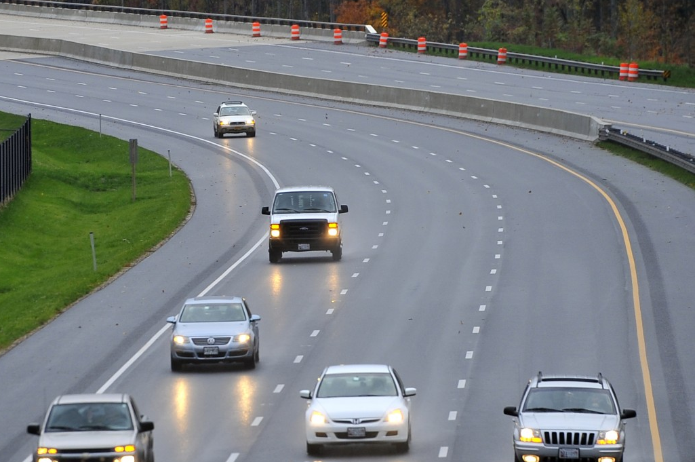
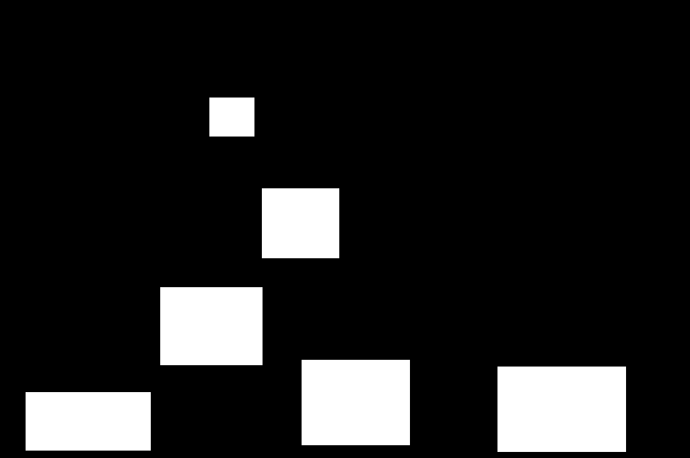
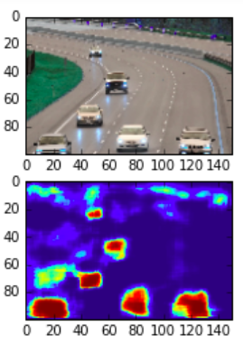
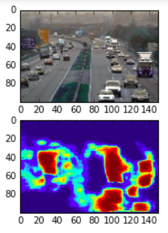

# TrafficDensityMap-Autoencoder
Generating a TrafficDensity MapDensity. As it used for determining the traffic density of the road. Traffic survelliance camera gives a frame by frame video of a specific road and the model help to determine the traffic density. Just input the traffic snapshot and it generate the headmap of that image.

As I have genarate my own dataset. I am using YOLO to generate the dataset. Take a different survelliance camera video and generated dataset from that survelliance "DatasetGenerate.py"

Sample data of 200 images is given in Dataset folder

Dataset is in below given from:

(X)Input image:

(Y)Predictable Output image:

Used Convolution Autoencoder. Autoencoder input is the color image of size (150,100,3) and output is the value between 0 to 1. As output layer has Sigmoid Activation Layer. Outputlayer size (150,100).

Training is done on 10000 images, over 200 epochs.

Results:

Future Works:

Working on larger size of the image about 300x100. Train model on Large amount of data.